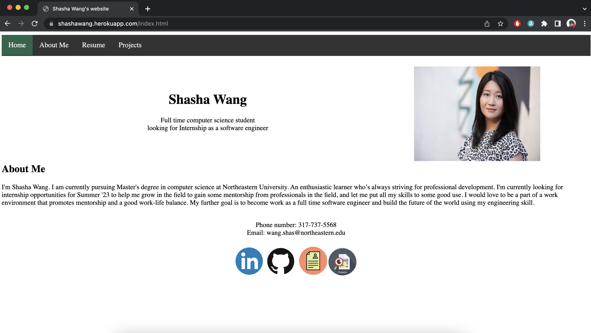
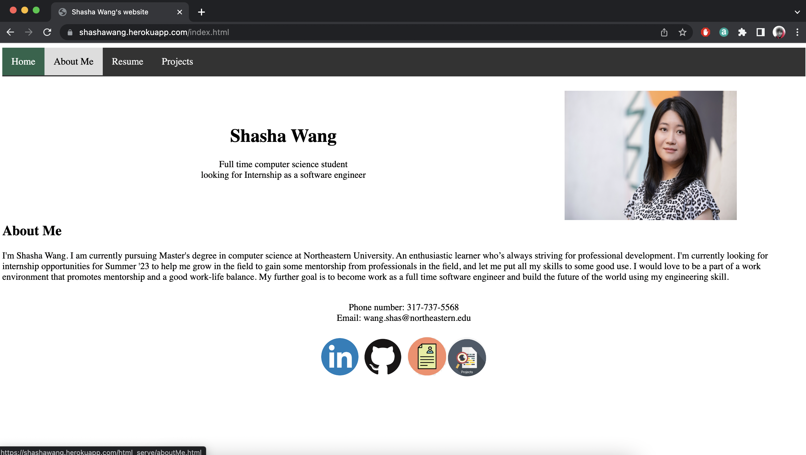
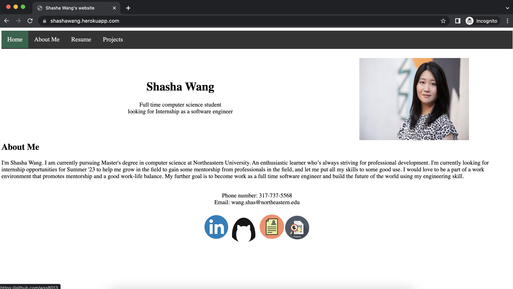
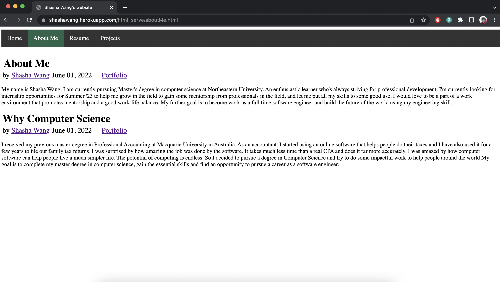
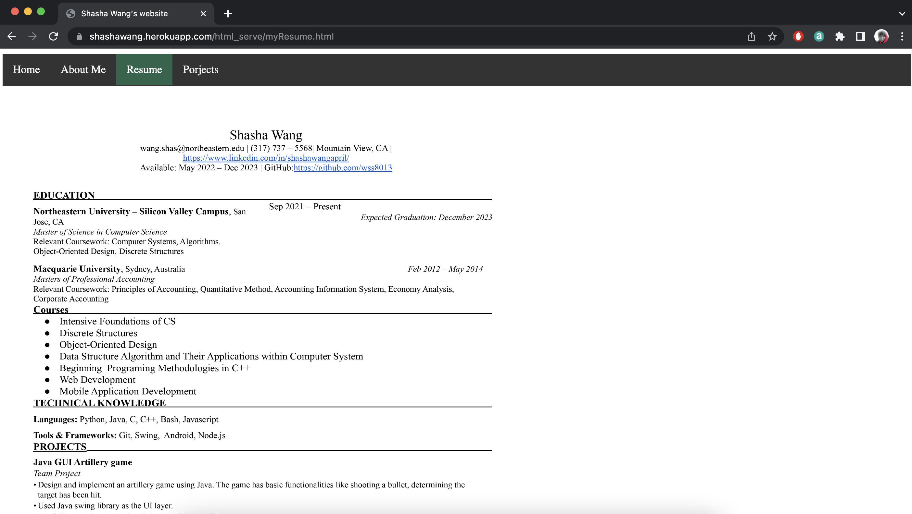
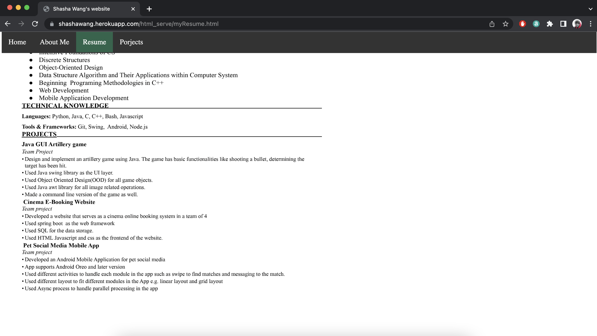
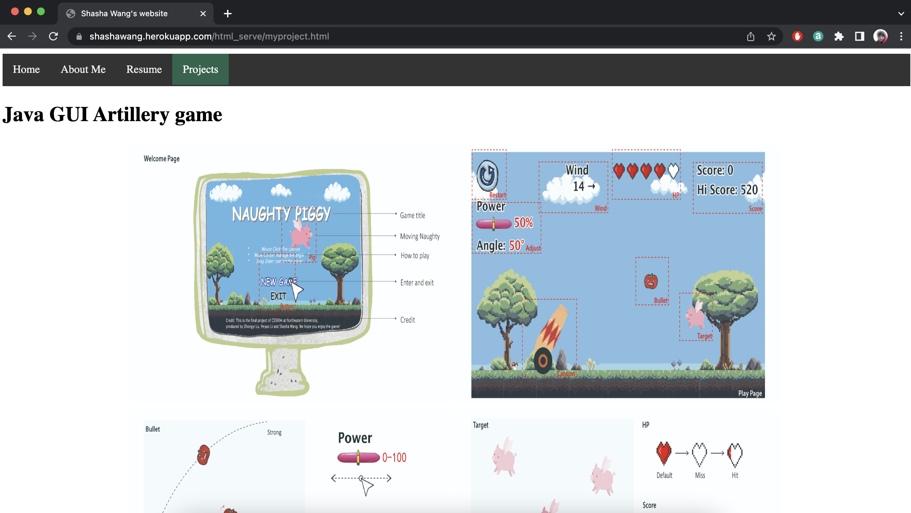
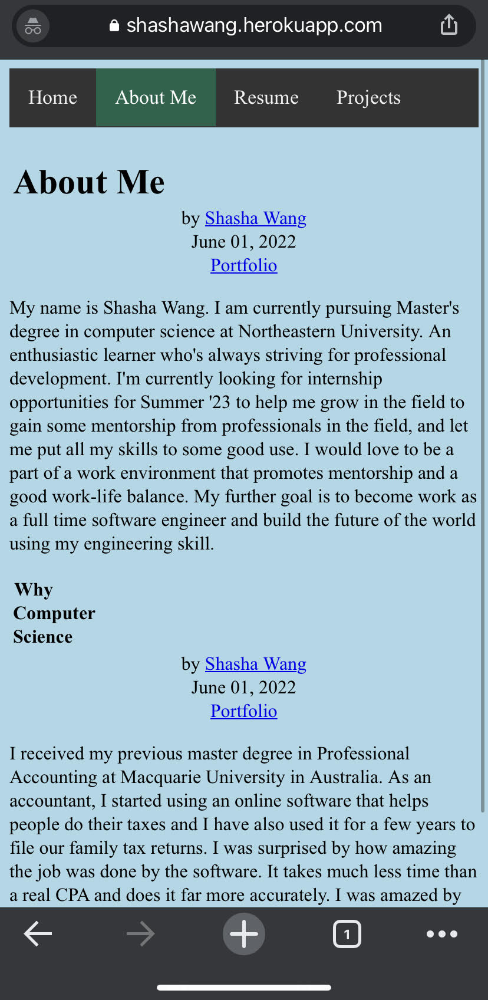
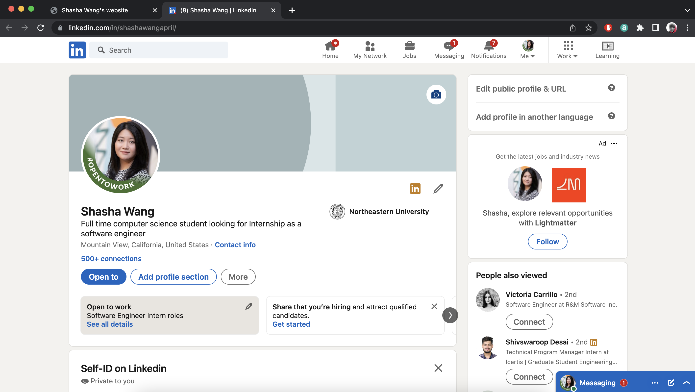
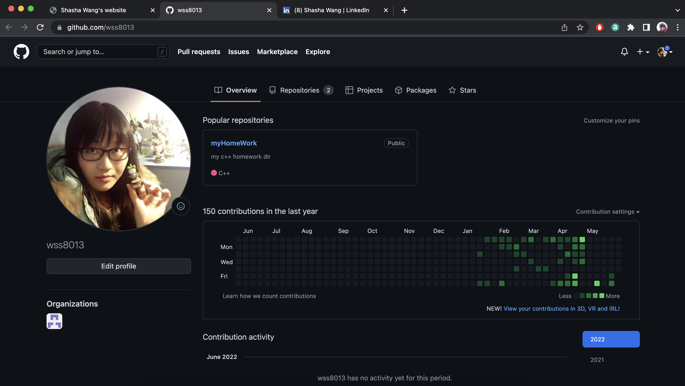

# PersonalWebsite-ShashaWang
* https://shashawang.herokuapp.com/
* It's Shasha Wang's personal website which includes some internal links to a breif introduction, resume and projects and two external links to the LinkedIn and GitHub.

# Landing page

The landing page includes a navigation bar on the top. My name, profile photo and a short intro of myself in the middle of the page. Some contact info including phone number and email address are under the intro. At the very bottom you will find some icon that links to my linkedin github(external links) resume(internal link) etc. All the elements in the navigation bar are pointing to internal links within the website. The external links will open a new tab while internal links will open the new page with the current tab.  

# Mouseover interaction (navigation buttons)

The Navigation bar has some mouse over effect defined in the css. When mouse hover on the navigation bar the color will change to grey. The color will change to green on user click. The green color will also highlight the current active page user is viewing. 

# Mouseover interaction (icons)

The icon on the bottom of the page will also change size on mouse hover on it. The hight of the icon will increase to 1.5 * original height and return to the original size on user mouse leave the icon. This is done by using jquery and is defined in indexjs.js . The event we used are called mouse 'mouseenter' and 'mouseleave'. 

# Internal link - about me (html table)

The page contains some more detailed info about me. This page is organized by html table where each table two rows and three colums. The heading of each article is at the first row left most cell and subtitles occupy all three cells in the second row. The intro is formated in paragraph tag in html. 

# Internal link - resume

The resume page shows user my resume in an image. This is formatted within only one div. 

# Navigation bar stays in sight when scroll the page

The resume image is longer than the web page some times user needs to scroll down, the navigation bar will never be scrolled out of the screen and will always be on the top of the web page. 

# Internal link - projects

Similarly the project page shows my project screenshot. The screenshots are organizaed by a 2X2 table with a heading on top of it. 

# Difference sized displays (phone screen)

The mobile version of the website looks slightly different, you can see the background is light blue and the subtitle arrangement is different than the desktop version center aligned vs left aligned. This is to bring a more comfort user experience when user using the mobile device to browse the website. This feature is done by media query to change different display based on screen size etc. 

All the internal pages will have the navigation bar on the top and will never have deadend so user can always choose where they want to go in the website. 

# External link - LinkedIn

# External link - GitHub

All the external links will open new browser tabs so that the site remains open in the user's browser.

